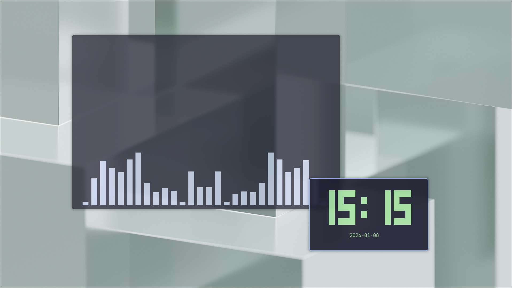
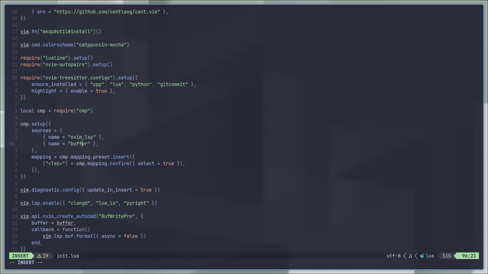

# ~/.dotfiles

My personal dotfiles.




## Installation

Clone the repository:

```sh
$ git clone https://github.com/lnkrr/dotfiles && cd dotfiles
```

Run the install script:

```sh
$ ./install.sh
```

## Keybindings

| Combination                       | Action                         |
| --------------------------------- | ------------------------------ |
| <kbd>Super + Enter</kbd>          | Terminal (foot)                |
| <kbd>Super + Backspace</kbd>      | Suspend (sleep)                |
| <kbd>Super + R</kbd>              | App launcher (fuzzel)          |
| <kbd>Super + B</kbd>              | Firefox                        |
| <kbd>Super + T</kbd>              | Telegram                       |
| <kbd>Super + N</kbd>              | Notifications (swaync)         |
| <kbd>Super + Y</kbd>              | Resource monitor (btop)        |
| <kbd>Super + S</kbd>              | Screenshot                     |
| <kbd>Super + W</kbd>              | Select wallpaper               |
| <kbd>Super + V</kbd>              | Clipboard manager              |
| <kbd>Super + O</kbd>              | Toggle Niri overview           |
| <kbd>Super + Q</kbd>              | Close window                   |
| <kbd>Super + H/J/K/L</kbd>        | Move focus                     |
| <kbd>Super + Ctrl + H/J/K/L</kbd> | Move window/column             |
| <kbd>Super + U/I</kbd>            | Change workspace               |
| <kbd>Super + Ctrl + U/I</kbd>     | Move column + change workspace |
| <kbd>Super + F</kbd>              | Maximize column                |
| <kbd>Super + Shift + F</kbd>      | Toggle floating                |
| <kbd>F11</kbd>                    | Toggle fullscreen              |

## Credits

- [Forest](backgrounds/forest.jpg) by
  [Sebastian Unrau](https://unsplash.com/@sebastian_unrau)
- [Abstract Glass](backgrounds/abstract-glass.jpg) and
  [Abstract Light](backgrounds/abstract-light.jpg) by
  [Pawel Czerwinski](https://unsplash.com/@pawel_czerwinski)
- [Flamingo](backgrounds/flamingo.jpg) by
  [Philippe BONTEMPS](https://unsplash.com/@philippeb)
- [Wall Sconce](backgrounds/wall-sconce.jpg) by
  [Ethan Hoover](https://unsplash.com/@ethanchoover)
- [White and Black Blocks](backgrounds/white-black-blocks.jpg) and
  [Abstract Dark](backgrounds/abstract-dark.jpg) by
  [Milad Fakurian](https://unsplash.com/@fakurian)
